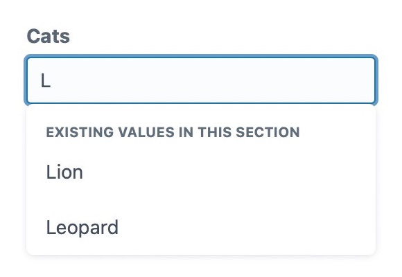

# AutoSuggest fieldtype plugin for Craft CMS

## Requirements

- Craft CMS 3.X or 4.x
- PHP 7.4+

## Installation

Install the plugin as follows:

1.  Open your terminal and go to your Craft project:

        cd /path/to/project

2.  Then tell Composer to load the plugin:

        composer require dodecastudio/craft-autosuggest

3.  In the Control Panel, go to Settings → Plugins and click the “Install” button for AutoSuggest.

## Overview

Once an Auto Suggest field has been created and added to a section within Craft, it will appear when editing the entry. If there are other entries in that section, typing in it will suggest existing values. This plugin uses Craft's built-in autosuggest component. When installed, it'll look a bit like this:

The list will by default show up to a maximum of 200 suggestions. Results are filtered to include the most frequently occuring.

### Field settings

You can set some default suggestions for each Auto Suggest field. This will ensure some initial values are presented to CP users if there are not yeht any entries in a given section. It's also helpful for guiding users to enter specific values.

## Plugin Settings

Default settings can be overridden. Please see the `autosuggest-config.php` file for details.

## Licence 🌳

This package is [Treeware](https://treeware.earth). If you use it in production, then we ask that you [**buy the world a tree**](https://plant.treeware.earth/dodecastudio/craft-autosuggest/).  
And why not? By contributing to the Treeware forest you’ll be creating employment for local families and restoring wildlife habitats.

If you've purchased trees through Ecologi, as part of the Treeware license, please let us know for a shout-out.
